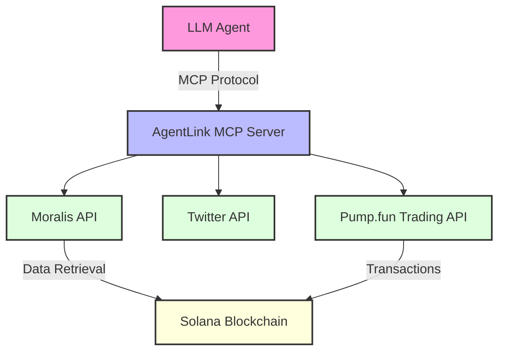
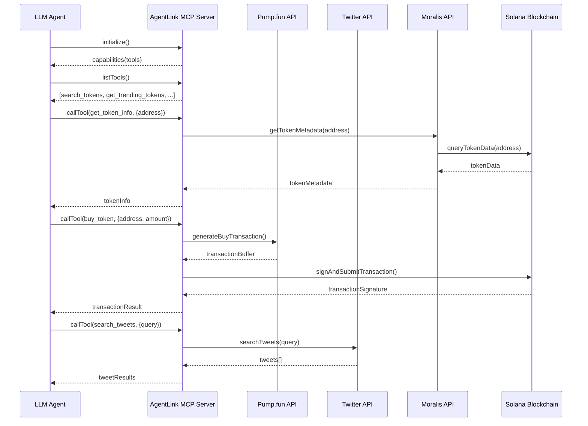

# AgentLink MCP Server

[](https://www.typescriptlang.org/)
[](https://modelcontextprotocol.io)
[](https://opensource.org/licenses/MIT)

AgentLink MCP Server is an implementation of the Model Context Protocol (MCP) that enables trading on Pump.fun using the Solana blockchain and provides Twitter integration. This server allows AI assistants to access cryptocurrency tools and social media functionality through a standardized protocol.

## Architecture Overview



## Features

- **Pump.fun Integration**: Trade tokens on Solana using Pump.fun
  - Search for tokens
  - Get trending tokens
  - Buy tokens
  - Sell tokens

- **Moralis API Integration**:
  - Enhanced token metadata retrieval from Solana blockchain
  - Token price information
  - Token details and supply data

- **Twitter Integration**:
  - Search for tweets
  - Post tweets

## Tool Flow Diagram



## Prerequisites

- Node.js (v18+)
- TypeScript
- Solana wallet
- Moralis API key (for retrieving token metadata from Solana)
- Twitter API credentials (optional, for Twitter functionality)

## Installation

1. Clone the repository
   ```bash
   git clone https://github.com/Jovvi26/agentlink-mcp.git
   cd agentlink-mcp
   ```

2. Install dependencies
   ```bash
   npm install
   ```

3. Create a `.env` file with your configuration values:
   ```
   # Pump.fun Configuration
   WALLET_PUBLIC_KEY=your_wallet_public_key
   WALLET_PRIVATE_KEY=your_wallet_private_key
   SOLANA_RPC_ENDPOINT=https://api.mainnet-beta.solana.com
   PUMPFUN_API_ENDPOINT=https://pumpportal.fun/api/trade-local

   # Twitter Configuration (optional)
   TWITTER_API_KEY=your_twitter_api_key
   TWITTER_API_KEY_SECRET=your_twitter_api_key_secret
   TWITTER_ACCESS_TOKEN=your_twitter_access_token
   TWITTER_ACCESS_TOKEN_SECRET=your_twitter_access_token_secret

   # Moralis API Configuration (for Solana data retrieval)
   MORALIS_API_KEY=your_moralis_api_key

   # Server Configuration
   SERVER_NAME=agentlink-mcp
   SERVER_VERSION=1.0.0
   ```

4. Build the project
   ```bash
   npm run build
   ```

## Usage

Start the MCP server:

```bash
npm run start
```

The server will be available for MCP clients to connect to via stdio (standard input/output).

## Testing

### Using TypeScript Test Client

The project includes a test directory with a TypeScript client for testing the MCP server:

```bash
cd test
npx tsc
node build/client.js
```

This will:
1. Connect to the MCP server
2. List available tools
3. Test the token info functionality

### Using MCP Inspector

For a richer testing experience, you can use the [MCP Inspector](https://github.com/modelcontextprotocol/inspector), which provides a visual interface for interacting with your MCP server:

```bash
# Requires Node.js v22.7.5+
npx @modelcontextprotocol/inspector node build/server.js
```

This will:
1. Start your MCP server
2. Launch the MCP Inspector at http://127.0.0.1:6274
3. Open your browser to the inspector interface

#### Using the MCP Inspector Interface

1. **Connect to your server**:
   - The inspector should automatically connect to your server
   - Ensure "STDIO" is selected as the Transport Type
   - You should see "Connected" status at the bottom of the sidebar

2. **Test tools**:
   - Click on the "Tools" tab to see available tools
   - Select a tool from the list (e.g., "get_token_info")
   - Enter the required parameters (e.g., a token address)
   - Click "Run Tool" to execute
   - View the results in the response panel

3. **Review history**:
   - The History section shows all previous requests
   - Click on any request to see its details

4. **Environment variables**:
   - Use the "Environment Variables" dropdown to set or modify environment variables
   - This is useful for providing your wallet keys and API keys

The MCP Inspector provides a comprehensive way to test all aspects of your MCP server, including tools, resources, and prompts.

## MCP Protocol

This server implements the [Model Context Protocol (MCP)](https://modelcontextprotocol.io) which standardizes how Large Language Models (LLMs) interact with external tools and resources. The protocol enables:

- Consistent tool interfaces
- Dynamic discovery of capabilities
- Structured data exchange
- Secure authorization flows

## API Documentation

### Pump.fun Tools

| Tool | Description | Parameters |
|------|-------------|------------|
| `search_tokens` | Search for tokens by name or symbol | `query` (string) |
| `get_trending_tokens` | Get trending tokens on Pump.fun | none |
| `buy_token` | Buy a token with SOL | `address` (string, required)<br>`solAmount` (number, required)<br>`slippage` (number, optional)<br>`priorityFee` (number, optional)<br>`pool` (string, optional) |
| `sell_token` | Sell a token | `address` (string, required)<br>`tokenAmount` (string, required)<br>`slippage` (number, optional)<br>`priorityFee` (number, optional)<br>`pool` (string, optional) |

### Moralis Data Retrieval Tools

| Tool | Description | Parameters |
|------|-------------|------------|
| `get_token_info` | Get detailed metadata about a token from Solana blockchain | `address` (string) |
| `get_token_price` | Get the current price of a token | `address` (string) |

### Twitter Tools

| Tool | Description | Parameters |
|------|-------------|------------|
| `search_tweets` | Search for tweets based on a query | `query` (string, required)<br>`count` (number, optional) |
| `post_tweet` | Post a new tweet | `text` (string, required) |

## Contributing

Contributions are welcome! Please feel free to submit a Pull Request to the [GitHub repository](https://github.com/Jovvi26/agentlink-mcp).

## License

This project is licensed under the MIT License - see the LICENSE file for details.

## Acknowledgements

- [Model Context Protocol](https://modelcontextprotocol.io) - For the protocol specification
- [Pump.fun](https://pump.fun) - For the token trading API
- [Moralis](https://moralis.io) - For Solana blockchain data retrieval
- [Twitter](https://developer.twitter.com) - For the Twitter API
- [MCP Inspector](https://github.com/modelcontextprotocol/inspector) - For the testing interface