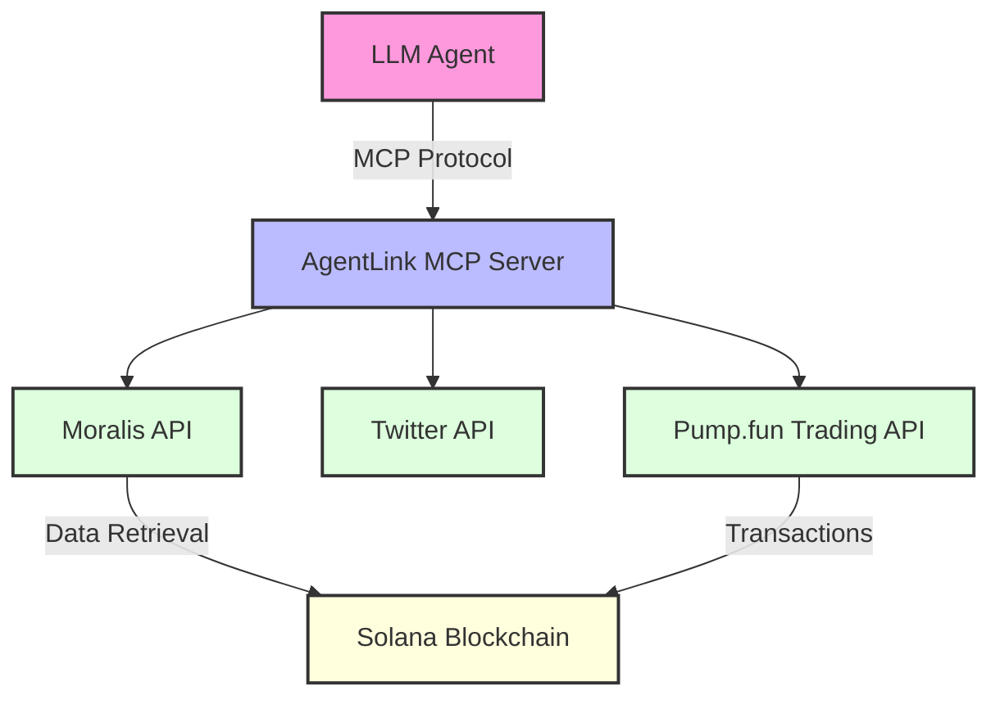
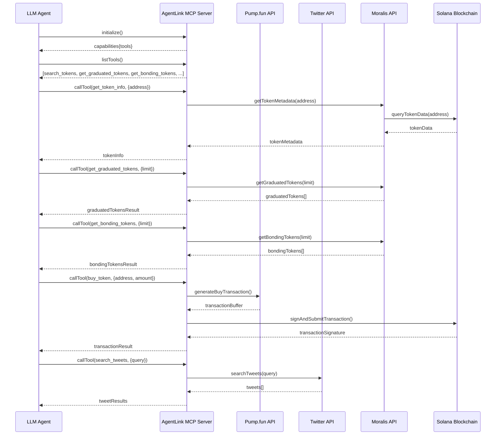

# AgentLink MCP Server

[](https://www.typescriptlang.org/)
[](https://modelcontextprotocol.io)
[](https://opensource.org/licenses/MIT)

AgentLink MCP Server is an implementation of the Model Context Protocol (MCP) that enables trading on Pump.fun using the Solana blockchain and provides Twitter integration. This server allows AI assistants to access cryptocurrency tools and social media functionality through a standardized protocol.

## Architecture Overview



## Features

- **Pump.fun Integration**: Trade tokens on Solana using Pump.fun
  - Search for tokens
  - Get graduated tokens (completed bonding phase)
  - Get bonding tokens (currently in bonding phase)
  - Buy tokens
  - Sell tokens

- **Moralis API Integration**:
  - Enhanced token metadata retrieval from Solana blockchain
  - Token price information
  - Bonding curve progress data
  - Token details and supply data

- **Twitter Integration**:
  - Search for tweets
  - Post tweets

## Tool Flow Diagram



## Prerequisites

- Node.js (v18+)
- TypeScript
- Solana wallet
- Moralis API key (for retrieving token metadata from Solana)
- Twitter API credentials (optional, for Twitter functionality)
- Claude for Desktop (for using with Claude)

## Installation

1. Clone the repository
   ```bash
   git clone https://github.com/Jovvi26/agentlink-mcp.git
   cd agentlink-mcp
   ```

2. Install dependencies
   ```bash
   npm install
   ```

3. Create a `.env` file with your configuration values:
   ```
   # Pump.fun Configuration
   WALLET_PUBLIC_KEY=your_wallet_public_key
   WALLET_PRIVATE_KEY=your_wallet_private_key
   SOLANA_RPC_ENDPOINT=https://api.mainnet-beta.solana.com
   PUMPFUN_API_ENDPOINT=https://pumpportal.fun/api/trade-local

   # Twitter Configuration (optional)
   TWITTER_API_KEY=your_twitter_api_key
   TWITTER_API_KEY_SECRET=your_twitter_api_key_secret
   TWITTER_ACCESS_TOKEN=your_twitter_access_token
   TWITTER_ACCESS_TOKEN_SECRET=your_twitter_access_token_secret

   # Moralis API Configuration (for Solana data retrieval)
   MORALIS_API_KEY=your_moralis_api_key

   # Server Configuration
   SERVER_NAME=agentlink-mcp
   SERVER_VERSION=1.0.0
   ```

4. Build the project
   ```bash
   npm run build
   ```

## Usage

Start the MCP server:

```bash
npm run start
```

The server will be available for MCP clients to connect to via stdio (standard input/output).

## Testing

### Using TypeScript Test Client

The project includes a test directory with a TypeScript client for testing the MCP server:

```bash
cd test
npx tsc
node build/client.js
```

This will:
1. Connect to the MCP server
2. List available tools
3. Test the token info functionality

### Using MCP Inspector

For a richer testing experience, you can use the [MCP Inspector](https://github.com/modelcontextprotocol/inspector), which provides a visual interface for interacting with your MCP server:

```bash
# Requires Node.js v22.7.5+
npx @modelcontextprotocol/inspector node build/server.js
```

This will:
1. Start your MCP server
2. Launch the MCP Inspector at http://127.0.0.1:6274
3. Open your browser to the inspector interface

#### Using the MCP Inspector Interface

1. **Connect to your server**:
   - The inspector should automatically connect to your server
   - Ensure "STDIO" is selected as the Transport Type
   - You should see "Connected" status at the bottom of the sidebar

2. **Test tools**:
   - Click on the "Tools" tab to see available tools
   - Select a tool from the list (e.g., "get_token_info")
   - Enter the required parameters (e.g., a token address)
   - Click "Run Tool" to execute
   - View the results in the response panel

3. **Review history**:
   - The History section shows all previous requests
   - Click on any request to see its details

4. **Environment variables**:
   - Use the "Environment Variables" dropdown to set or modify environment variables
   - This is useful for providing your wallet keys and API keys

The MCP Inspector provides a comprehensive way to test all aspects of your MCP server, including tools, resources, and prompts.

## Example Interactions with Claude

Once your AgentLink MCP server is connected to Claude, you can use natural language to access its capabilities:

- "Can you search for tweets about Solana NFTs?"
- "What tokens have recently graduated from the bonding phase on Pump.fun?"
- "Show me tokens that are currently in the bonding phase on Pump.fun"
- "I'd like to get information about a specific token on Solana. The address is..."
- "Could you help me buy some SOL tokens?"

Claude will automatically identify when to use the appropriate tools provided by your AgentLink MCP server.

## MCP Protocol

This server implements the [Model Context Protocol (MCP)](https://modelcontextprotocol.io) which standardizes how Large Language Models (LLMs) interact with external tools and resources. The protocol enables:

- Consistent tool interfaces
- Dynamic discovery of capabilities
- Structured data exchange
- Secure authorization flows

## Claude for Desktop Integration

To use the AgentLink MCP Server with Claude for Desktop, follow these steps:

### 1. Configure Claude for Desktop

Create or edit the Claude for Desktop configuration file:

- **macOS**: `~/Library/Application Support/Claude/claude_desktop_config.json`
- **Windows**: `%APPDATA%\Claude\claude_desktop_config.json` 

Add the following configuration to connect Claude to your AgentLink MCP server:

```json
{
  "mcpServers": {
    "agentlink": {
      "command": "node",
      "args": [
        "/path/to/your/agentlink-mcp/mcp-startup.js"
      ],
      "cwd": "/path/to/your/agentlink-mcp"
    }
  }
}
```

Replace `/path/to/your/agentlink-mcp` with the actual path to your project directory.

#### Example paths:

- **macOS**: `/Users/username/projects/agentlink-mcp`
- **Windows**: `C:\\Users\\username\\projects\\agentlink-mcp`

### 2. Restart Claude for Desktop

After setting up the configuration file, restart Claude for Desktop completely. This ensures Claude loads your MCP server configuration.

### 3. Connect to the Server

1. Open Claude for Desktop
2. Click on the settings/preferences icon in the lower left corner
3. In the menu that appears, locate and click on "agentlink" under the connected servers section

You'll know the server is connected properly when you can see "agentlink" in the preferences menu.

### 4. Troubleshooting

If you don't see "agentlink" in the preferences menu:

- Check the Claude for Desktop logs:
  - **macOS**: `~/Library/Logs/Claude/mcp*.log`
  - **Windows**: `%APPDATA%\Claude\logs\mcp*.log`

- Verify your server is running properly with the MCP Inspector (see Testing section)

- Ensure your file paths in `claude_desktop_config.json` are correct and use absolute paths

- Make sure your environment variables are set up correctly

- On Windows, you may need to use double backslashes in paths (`\\`) or forward slashes (`/`)

## API Documentation

### Pump.fun Tools

| Tool | Description | Parameters |
|------|-------------|------------|
| `search_tokens` | Search for tokens by name or symbol | `query` (string) |
| `get_graduated_tokens` | Get tokens that have completed the bonding phase | `limit` (number, optional)<br>`cursor` (string, optional) |
| `get_bonding_tokens` | Get tokens currently in the bonding phase | `limit` (number, optional)<br>`cursor` (string, optional) |
| `buy_token` | Buy a token with SOL | `address` (string, required)<br>`solAmount` (number, required)<br>`slippage` (number, optional)<br>`priorityFee` (number, optional)<br>`pool` (string, optional) |
| `sell_token` | Sell a token | `address` (string, required)<br>`tokenAmount` (string, required)<br>`slippage` (number, optional)<br>`priorityFee` (number, optional)<br>`pool` (string, optional) |

### Moralis Data Retrieval Tools

| Tool | Description | Parameters |
|------|-------------|------------|
| `get_token_info` | Get detailed metadata about a token from Solana blockchain | `address` (string) |
| `get_token_price` | Get the current price of a token | `address` (string) |

### Twitter Tools

| Tool | Description | Parameters |
|------|-------------|------------|
| `search_tweets` | Search for tweets based on a query | `query` (string, required)<br>`count` (number, optional) |
| `post_tweet` | Post a new tweet | `text` (string, required) |

## Token Lifecycle on Pump.fun

### Bonding Phase
Tokens on Pump.fun begin in a **bonding phase** where price is determined by a bonding curve. During this phase:

- Tokens are minted as users buy them
- Price increases according to a predefined curve
- The `bondingCurveProgress` property indicates how close a token is to graduation (0-100%)
- Higher bonding curve progress means the token is closer to graduation

### Graduated Phase
Once a token completes its bonding phase, it **graduates** to a liquid trading phase where:

- Token supply is fixed
- Price is determined by market demand via liquidity pools
- Tokens can be freely traded
- Graduation timestamp indicates when the token completed bonding

The `get_bonding_tokens` and `get_graduated_tokens` tools allow you to track tokens in each phase of their lifecycle on Pump.fun.

## Contributing

Contributions are welcome! Please feel free to submit a Pull Request to the [GitHub repository](https://github.com/Jovvi26/agentlink-mcp).

## License

This project is licensed under the MIT License - see the LICENSE file for details.

## Acknowledgements

- [Model Context Protocol](https://modelcontextprotocol.io) - For the protocol specification
- [Pump.fun](https://pump.fun) - For the token trading API
- [Moralis](https://moralis.io) - For Solana blockchain data retrieval
- [Twitter](https://developer.twitter.com) - For the Twitter API
- [MCP Inspector](https://github.com/modelcontextprotocol/inspector) - For the testing interface
- [Claude for Desktop](https://claude.ai/download) - For AI assistant integration